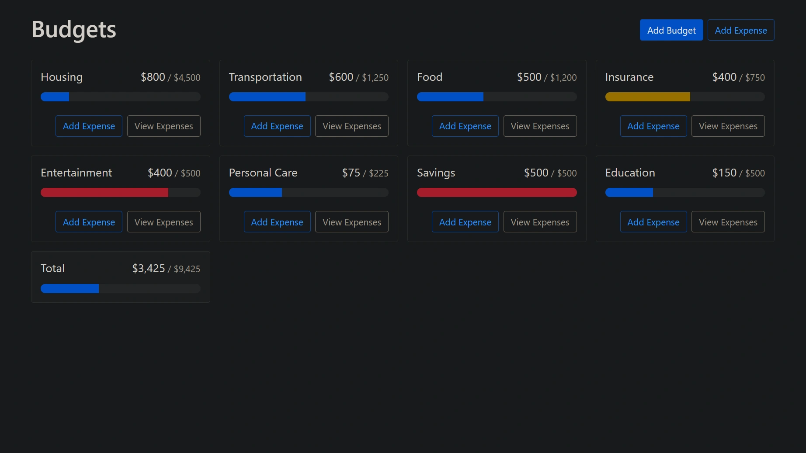

<div align="center">
    <a href="https://budget-fv.netlify.app/" target="_blank">
      
    </a>
  <h3 align="center">Budget App - React</h3>
</div>

##  <br /> 📋 <a name="table">Table of Contents</a>

- ✨ [Introduction](#introduction)
- ⚙️ [Tech Stack](#tech-stack)
- 📝 [Features](#features)
- 🚀 [Quick Start](#quick-start)

##  <br /> <a name="introduction">✨ Introduction</a>

**[EN]** Budgeting application built using React, focusing on CRUD (Create, Read, Update, Delete) operations. It covers intermediate and beginner-level React concepts, demonstrating how to manage budget data effectively. 

**[FR]** Application de gestion de budget construite avec React, mettant l'accent sur les opérations CRUD (Create, Read, Update, Delete). Elle couvre des concepts intermédiaires et débutants de React, démontrant comment gérer efficacement les données budgétaires.

##  <br /> <a name="tech-stack">⚙️ Tech Stack</a>

- **React** is a popular JavaScript library for building user interfaces, particularly single-page applications where data changes over time. React's component-based architecture allows developers to create reusable UI components, making development more efficient and the codebase easier to maintain. 

- **Bootstrap** is a front-end framework celebrated for its extensive suite of pre-styled components and responsive grid system. It simplifies the development of mobile-first websites and applications, offering developers flexibility and cross-browser compatibility.


## <br/> <a name="features">📝 Features</a>

👉 **React**: Utilizes React's component-based architecture for building dynamic user interfaces.

👉 **CRUD**: Implements Create, Read, Update, and Delete functionalities for managing budget items.

👉 **Data Management**: Demonstrates effective data management techniques in React applications.


## <br /> <a name="quick-start">🚀 Quick Start</a>

Follow these steps to set up the project locally on your machine.

<br/>**Prerequisites**

Make sure you have the following installed on your machine:

- [Git](https://git-scm.com/)
- [Node.js](https://nodejs.org/en)
- [npm](https://www.npmjs.com/) (Node Package Manager)

<br/>**Cloning the Repository**

```bash
git clone {git remote URL}
```

<br/>**Installation**

Let's install the project dependencies, from your terminal, run:

```bash
npm install
# or
yarn install
```


<br/>**Running the Project**

Installation will take a minute or two, but once that's done, you should be able to run the following command:

```bash
npm start
# or
yarn start
```

Open [`http://localhost:3000`](http://localhost:3000) in your browser to view the project.